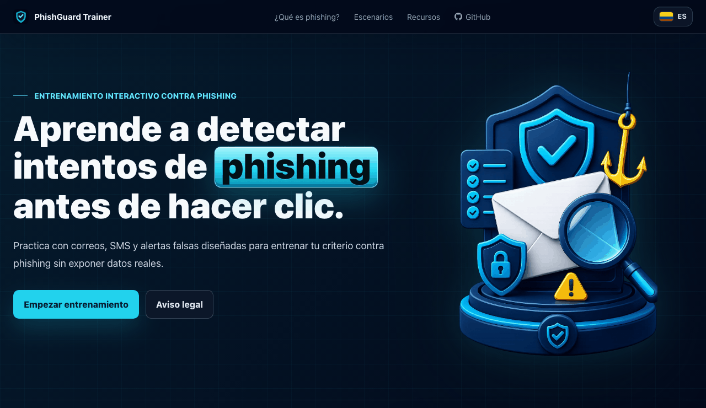

# PhishGuard Trainer

🌐 Also available in [English](README.md).

PhishGuard Trainer es un entrenador estático y bilingüe de concientización contra phishing, construido con HTML, CSS y JavaScript vanilla. Ayuda a practicar la identificación de señales sospechosas en escenarios realistas, pero completamente ficticios, de correos electrónicos y SMS.

<p align="center">
  
</p>

## Por qué existe

El proyecto está diseñado para educación defensiva en seguridad. No usa marcas reales, no recolecta credenciales, no envía correos ni mensajes SMS, no clona páginas de inicio de sesión y no almacena datos personales.

## Características

- Interfaz bilingüe: español e inglés.
- Escenarios en español contextualizados para Colombia.
- Escenarios en inglés contextualizados para Estados Unidos.
- Simulaciones realistas y ficticias de correo electrónico y SMS.
- Selección interactiva de señales sospechosas y cálculo de puntaje.
- Navegación por teclado, formularios semánticos y soporte para movimiento reducido.
- Página 404 amigable para hosting estático y GitHub Pages.
- Archivos estáticos que pueden servirse con cualquier servidor HTTP.

## Vista previa

La primera pantalla presenta el flujo de entrenamiento. Luego la persona elige un escenario, revisa un mensaje simulado, marca elementos sospechosos y recibe un puntaje con explicaciones.

## Ejecutar localmente

No se requiere backend ni paso de compilación, pero el proyecto debe servirse mediante un servidor HTTP estático desde el directorio `web/`. Abrir `web/index.html` directamente desde el sistema de archivos puede comportarse distinto a un servidor estático real.

Python:

```bash
cd web
python3 -m http.server 8000
```

Node.js:

```bash
cd web
npx serve .
```

Luego abre:

```txt
http://localhost:8000
```

El selector de idioma guarda la preferencia en `localStorage`. Las secciones principales usan anclas con hash:

```txt
/#hero
/#what-is-phishing
/#scenarios
/#resources
/#ethics
```

## Validar

Ejecuta las validaciones de sintaxis y puntaje antes de abrir un PR:

```bash
node --check web/assets/js/data.js
node --check web/assets/js/scoring.js
node --check web/assets/js/app.js
node --check web/sw.js
node tests/scoring.test.js
```

Para revisión manual de interfaz, usa [docs/QA.md](docs/QA.md). Para revisar seguridad de contenido, usa [docs/CONTENT_SAFETY.md](docs/CONTENT_SAFETY.md).

## Estructura del proyecto

```txt
phishguard-trainer/
├── docs/
│   ├── CONTENT_SAFETY.md
│   ├── QA.md
│   ├── demo-en.gif
│   └── demo.gif
├── tests/
│   └── scoring.test.js
├── web/
│   ├── 404.html
│   ├── favicon.svg
│   ├── index.html
│   ├── sw.js
│   └── assets/
│       ├── css/custom.css
│       ├── img/
│       └── js/
│           ├── app.js
│           ├── data.js
│           └── scoring.js
├── .github/
├── CONTRIBUTING.md
├── LICENSE
├── README.es.md
├── README.md
└── SECURITY.md
```

## Editar escenarios

El contenido de los escenarios vive en:

```txt
web/assets/js/data.js
```

Cada escenario usa:

- `id`
- `title`
- `difficulty`
- `type`
- `context`
- `learning_goal`
- `mock_ui`
- `elements`

Cada elemento seleccionable usa:

- `id`
- `label`
- `display`
- `is_suspicious`
- `explanation`

Los escenarios nuevos deben ser ficticios, defensivos y seguros para publicar. Para cambios grandes de contenido, abre primero un issue y revisa [docs/CONTENT_SAFETY.md](docs/CONTENT_SAFETY.md).

## Puntaje

El puntaje está implementado en:

```txt
web/assets/js/scoring.js
```

Fórmula:

```txt
score = round((correct_hits / total_suspicious) * 100 - false_positives * 10)
```

El puntaje se limita entre 0 y 100.

## Escenarios actuales

Español / Colombia:

1. Verificación urgente de cuenta bancaria.
2. Mensaje de devolución tributaria.
3. Cuota de correo institucional.
4. Notificación de comparendo pendiente.

Inglés / Estados Unidos:

1. Payroll verification request.
2. Package delivery fee notice.
3. MFA reset alert.
4. Unpaid toll payment notice.

## Contribuciones y seguridad

Lee [CONTRIBUTING.md](CONTRIBUTING.md) antes de proponer cambios, especialmente nuevos escenarios o contenido visible para usuarios.

Para reportar problemas de seguridad, contenido inseguro o riesgos de mal uso, sigue [SECURITY.md](SECURITY.md).

## Licencia

Este proyecto está licenciado bajo la [Licencia MIT](LICENSE).
