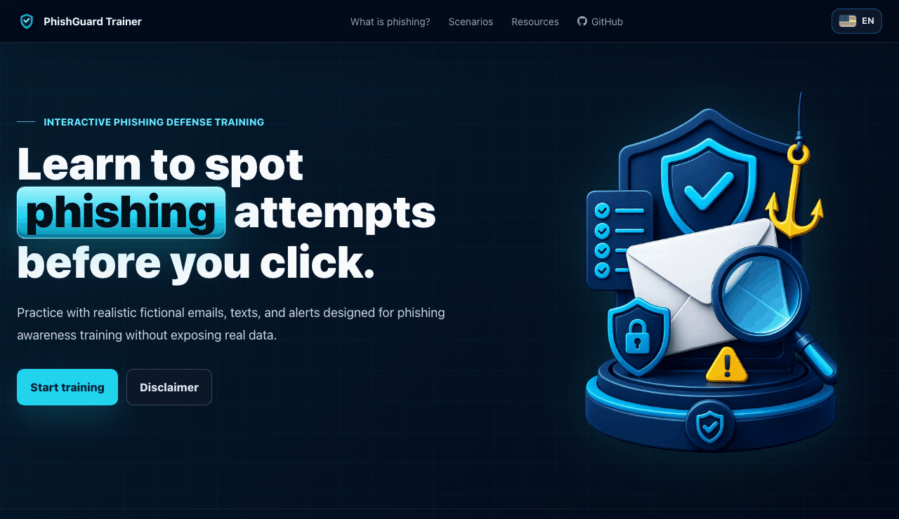

# PhishGuard Trainer

> 🌐 También disponible en [Español](README.es.md).

PhishGuard Trainer is a static, bilingual phishing awareness trainer built with HTML, CSS, and vanilla JavaScript. It helps learners practice spotting suspicious signals in realistic but fully fictional email and SMS scenarios.

<p align="center">
  
</p>

## Why it exists

The project is designed for defensive security education. It does not use real brands, collect credentials, send emails or SMS messages, clone login pages, or store personal data.

## Features

- Bilingual interface: Spanish and English.
- Spanish scenarios contextualized for Colombia.
- English scenarios contextualized for the United States.
- Realistic fictional email and SMS mockups.
- Interactive suspicious-signal selection and scoring.
- Accessibility-minded keyboard focus, semantic forms, and reduced-motion support.
- Friendly 404 fallback for static hosting and GitHub Pages.
- Static files that can be served by any HTTP static server.

## Preview

The first screen introduces the training flow, then learners choose a scenario, inspect a simulated message, select suspicious elements, and review a score with explanations.

## Run locally

No backend or build step is required, but the project should be served through a static HTTP server from the `web/` directory. Opening `web/index.html` directly from the filesystem can behave differently from a real static server.

Python:

```bash
cd web
python3 -m http.server 8000
```

Node.js:

```bash
cd web
npx serve .
```

Then open:

```txt
http://localhost:8000
```

The language toggle stores the selected language in `localStorage`. Main page sections use hash anchors:

```txt
/#hero
/#what-is-phishing
/#scenarios
/#resources
```

## Validate

Run syntax checks and scoring tests before opening a PR:

```bash
node --check web/assets/js/data.js
node --check web/assets/js/scoring.js
node --check web/assets/js/app.js
node --check web/sw.js
node tests/scoring.test.js
node tests/pwa.test.js
```

For manual UI checks, use [docs/QA.md](docs/QA.md). For scenario safety review, use [docs/CONTENT_SAFETY.md](docs/CONTENT_SAFETY.md). For open source credits, see [docs/ACKNOWLEDGMENTS.md](docs/ACKNOWLEDGMENTS.md).

## Project structure

```txt
phishguard-trainer/
├── docs/
│   ├── CONTENT_SAFETY.md
│   ├── QA.md
│   ├── demo-en.gif
│   └── demo.gif
├── tests/
│   └── scoring.test.js
├── web/
│   ├── 404.html
│   ├── favicon.svg
│   ├── index.html
│   ├── sw.js
│   └── assets/
│       ├── css/custom.css
│       ├── img/
│       └── js/
│           ├── app.js
│           ├── data.js
│           └── scoring.js
├── .github/
├── CONTRIBUTING.md
├── LICENSE
├── README.es.md
├── README.md
└── SECURITY.md
```

## Editing scenarios

Scenario content lives in:

```txt
web/assets/js/data.js
```

Each scenario uses:

- `id`
- `title`
- `difficulty`
- `type`
- `context`
- `learning_goal`
- `mock_ui`
- `elements`

Each selectable element uses:

- `id`
- `label`
- `display`
- `is_suspicious`
- `explanation`

New scenarios should be fictional, defensive, and safe to publish. Prefer opening an issue before a large scenario PR, and review [docs/CONTENT_SAFETY.md](docs/CONTENT_SAFETY.md).

## Scoring

Scoring is implemented in:

```txt
web/assets/js/scoring.js
```

Formula:

```txt
score = round((correct_hits / total_suspicious) * 100 - false_positives * 10)
```

The score is clamped between 0 and 100.

## Current scenarios

Spanish / Colombia:

1. Verificacion urgente de cuenta bancaria.
2. Mensaje de devolucion tributaria.
3. Cuota de correo institucional.
4. Notificacion de comparendo pendiente.

English / United States:

1. Payroll verification request.
2. Package delivery fee notice.
3. MFA reset alert.
4. Unpaid toll payment notice.

## Contributing and security

Please read [CONTRIBUTING.md](CONTRIBUTING.md) before proposing changes, especially new scenarios or user-facing content.

To report security issues, unsafe content, or misuse risks, follow [SECURITY.md](SECURITY.md).

## License

This project is licensed under the [MIT License](LICENSE).
